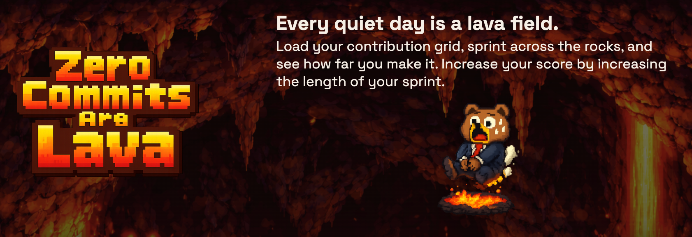

# ZeroCommitsAreLava

<p align="center">
  <a href="https://nodejs.org/en/" aria-label="Node.js">
    
  </a>
  <a href="https://docs.aws.amazon.com/cdk/" aria-label="AWS CDK">
    
  </a>
  <a href="https://www.typescriptlang.org/" aria-label="TypeScript">
    
  </a>
</p>

<p align="center">
  
</p>

A lightweight web game that turns your contribution calendar into a lava-running puzzle, built for low-cost AWS hosting with a static-first architecture and minimal serverless pieces.

## Highlights
- Canvas-based game UI with 7-attempt simulation + replay.
- GitHub + GitLab contribution fetching (public accounts).
- DynamoDB cache to reduce upstream calls.
- Share page HTML with OpenGraph tags for social previews.
- CDK stack: S3 + CloudFront (OAC) + HTTP API + Lambda + DynamoDB.

## Run locally

### 1) Install dependencies
```
npm install
npm --prefix backend install
npm --prefix frontend install
npm --prefix cdk install
```

### 2) Backend (local API)
Create `backend/.env`:
```
ALLOWED_ORIGINS=http://localhost:5173
CACHE_TTL_SECONDS=21600
FRONTEND_BASE_URL=http://localhost:5173
PUBLIC_BASE_URL=http://localhost:8787
```

Start the local API server:
```
npm --prefix backend run dev
```

### 3) Frontend
Create `frontend/.env`:
```
VITE_API_BASE_URL=http://localhost:8787
VITE_SHARE_BASE_URL=http://localhost:8787
```

Start the UI:
```
npm --prefix frontend run dev
```

## Deploy (CDK)

### 1) Build frontend
```
npm --prefix frontend run build
```

### 2) Bootstrap (first time only)
```
npm --prefix cdk run bootstrap
```

### 3) Deploy
```
npm --prefix cdk run deploy -c route53Domain=zerocommitsarelava.com
```

Outputs include:
- CloudFront URL (static site)
- API base URL (HTTP API)

## Custom domain (included)
The CDK stack provisions:
- ACM certificate in `us-east-1`.
- CloudFront aliases for root + www.
- Route53 A/AAAA alias records.

Provide the domain with `-c route53Domain=example.com` (or `ROUTE53_DOMAIN`) and ensure the hosted zone exists in Route53.

## Private account support (optional)
By default the game only supports public accounts for security and simplicity. To support private accounts:

### GitHub private contributions
- Require a GitHub token (PAT) with `read:user` and `repo` scopes.
- Use authenticated GitHub GraphQL exclusively.
- Update the UI copy to indicate a token is required.
- Store the token in AWS Secrets Manager (the stack already reads `zero-commits-are-lava/GITHUB_TOKEN`).

### GitLab private profiles
- Private profiles do not expose `/users/:username/calendar.json` publicly.
- You would need to add an authenticated GitLab API fetch (PAT) and remove the hard restriction to `gitlab.com`.
- Add a server-side allowlist of GitLab hosts and store the PAT in Secrets Manager.

## Notes
- CloudFront security headers are enabled via a Response Headers Policy.
- The API CORS allowlist includes the custom domain and the CloudFront domain.
- For large `weeks` values (near 52), the frontend fetches each attempt separately to stay within the max range limit.

## Support
[Support on Ko-fi](https://ko-fi.com/aimeej)
